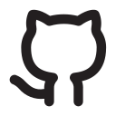
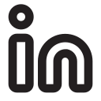
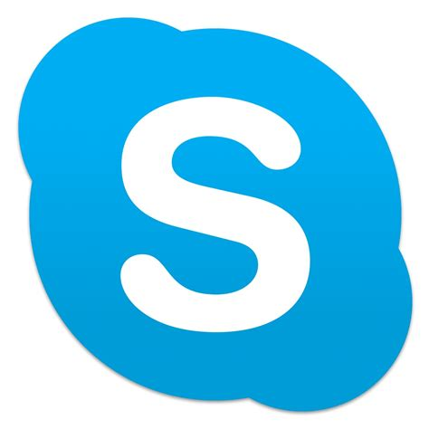

<link rel="stylesheet" type="text/css" media="all" href="assets/styles.css" />

# Valentin Kononov
### Full-Stack Developer, Speaker, Trainer

## Summary

Full-Stack software developer, interested in web development using TypeScript, Backend development with NodeJS, NestJS, .NET Core. But not limited to it, open for the new skills. I enjoy attending conferences as a Speaker with technology talsk. Flexible and self motivated, I'm interested in being part of some framework development or product for developers. I love comprehensive tasks, learning new technologies and solving tech problems. 

<!--  -->

## Contacts

     
    
valentin.kononov@gmail.com

     
    
<a href="https://github.com/valentinkononov">https://github.com/valentinkononov</a>

    
    
<a href="https://www.linkedin.com/in/valentin-kononov/">https://www.linkedin.com/in/valentin-kononov/</a>

     
    
/

    

    
+375 29 784 8999

     
    
valentin_kononov

 

     
    
@ValentinKononov

     
    
<a href="https://www.facebook.com/pinckrow">https://www.facebook.com/pinckrow</a>

     
    
<a href="https://medium.com/@valentinkononov">https://medium.com/@valentinkononov</a>

     
    
<a href="https://habr.com/ru/users/pinckrow/posts/">https://habr.com/ru/users/pinckrow/posts/</a>

## Story

I've been working in software development since university for more than 11 years. Initially from .NET backgroung, I grew into management of projects inside EPAM, was involved into company processes at some level. Then I changed my primary direction back into code writing, architecture and technical leadership.

Now I dedicate more time to coding and reseraching new technologies, I've experienced in web development with Angular, backend development with .NET, .NET Core, NodeJS, NestJS,  mobile cross platform development with React Native and other things which help to automate stuff and solve technical issues. 

Apart from the code writing, I lead a team of developers and handle customer communication for several projects, provide planning and staffing allocation.

Starting from 2017 I'm into conferences speaking in the .NET and Angular area. I had speaking and training experience before, but now I provide deeply prepared technical talks, submit and participate in several international conferences. 

Another intersting but rather small activity for myself is doing trainings and providing technical consultancy to the clients and company team members.

### Facts

 - Skilled in Angular development, prepared several technical talks on this matters, completed range of Angular projects and Frontend or Full-Stack developer. I have 2+ years of such experience.
 - Skilled in .NET / .NET Core development, experienced with EntityFramework, WEB API, Authentication, Parallel Programming in .NET area. More than 10 years.
 - Created Architecture for small and mid size web applications and platforms, including Relational Data Base design
 - Experience with Node.JS and Nest.JS including design of non-relational data models. About 2 years.
 - Experience and desire to do conference talks and articles on technical aspects of software development
 - Russian and English languages, spoken and written
 - Can effectively work remotely

## Conferences and MeetUps

#### Planned

 - https://devfest.moscow/ in November 2019
 - https://devfest.gdgnn.ru in November 2019

#### Completed

 - [AngularBelarus](https://www.meetup.com/ru-RU/angularbelarus) meetup #1, talk about NestJS, [video recording](https://www.youtube.com/watch?v=DNSwqq3jitc)
 - [ngVikings](https://ngvikings.org) conference, talk about Angular Bad Practices, [video recording](https://www.youtube.com/watch?v=QU739zZvkhE)
 - [GDG Dev Fest Belarus 2018](https://2018.devfest.by/) conference, talk about Application State Management, [video recording](https://www.youtube.com/watch?v=AQi7tzqMmM8)
 - [SarDotNet meetup 2018](https://vk.com/sardotnet), CQRS and Event Sourcing [video recording](https://www.youtube.com/watch?v=grtNzcLzwtM)
 - Several other local meetups with the simalar topics
 - Several trainings and tech talks as part of educational activities in my companies (Agile training, Code Quality Training, Scrum Training, 'Features of a national programming' - training about cultural differences in IT industry and some others)

### Magazine Articles about me
 - [Interview with me by ngVikings member - Marta Wisniewska](https://www.flipsnack.com/MartaWPL/behind-the-code-ngvikings.html)

### Projects and Case Studies

Akveo - **Nebular and Ngx-Admin Training** - Summer 2019, Minsk. 

I did several training sessions about our company open source products (Nebular and NGX-Admin) and Angular in general.

----

Akveo - **Backend Bundles** - 
November 2018 - current time, Minsk. 

I've created architecture approach and implemented a significant part of a code for this project. The idea is to create development template for both frontend and backend, integrated together via REST services. Angular frontend and bunch of different backends - .NET, .NET Core, Java, Node.JS, Nest.JS and some others. Product is commercial and selled by our company.
I am also involved into clients interaction, planning and continuous integration using SH scripts to prepare, build and test code before putting to the store.

The main project challange is to make sure the single UI with several varints works with the range of backends, second biggest challange is to make sure each variant of Angular UI is built without errors automatically.

**Stack**: Angular, Nebular, Ngx-Admin, .NET Web API, .NET Core Web API, Entity Framework, Node.JS, Nest.JS, Mongoose, MongoDB, SQl Server, SH Scripts, Git

---

Akveo - **TV Advertisement Management App** - September 2018 - November 2019, Minsk. 

Angular CRUD application to organize the process of adding and editing advertisements for TV company including schedule management. Our company did initial architecture work to provide base Angular Application backbone, services and state management.

**Stack**: Angular, MobX, Git

---

Akveo - **Mobile app for electrical service workers in Canada** - May 2018 - January 2019, Minsk. 

I worked as technical lead, architect and mobile developer for this project. We created cross platform mobile app using React Native framework for the mobile part and .NET Web API with Dapper as mini ORM for the backend part. Application was designed as offline first to support full offline mode and synchronization. Now it is officially in production and several companies in Canada uses it.

The main challange was in creation stable data synchronization process. We used SQL Server Change Tracking for this from the backend perspective.
On the mobile side we needed to securely store data per user, we choose to use Realm data base for it. It has own challanges in terms of performance. 

**Stack**: React Native, Realm database, MobX, .NET Web API, SQl Server, Dapper, Git

---

Akveo - **Legal Document Storage and Analytics** - November 2017 - October 2018, Minsk. 

CRUD application with Angular frontend and .NET Web API with Entity Framework on a backend side. I worked as Technical Lead, Architect and full-stack developer on this project. Application was designed to help legal officers to fill legal data and see visual analytics. UX was complicated because of necessety to add big amount of textual information to the UI.

Another challange was related to Angular performance due to big ammount of different components in the UI. 

**Stack**: Angular, MobX, .NET Web API, SQL Server, Autofac, Rotativa, Git

---

EPAM - **Oil and Gas Account** - October 2013, Russia, Saratov - November 2017, Belarus, Minsk.

Group of Projects for one of the largest Oil&Gas company, implementation of the software for the internal business process of the customer. Sample of the business area is Risk Assessment or well certification. Business value of projects is to setup, simplify and speed up processes for Customer, which will lead for finance benefits. Total amount of people under my supervision is 25 – 30. During this period I was mostly involved into coordination, staffing, communications, security questions, but also participated in serious bug fixes, estimation and performance improvements.

This project is one of the most important and interesting in my career. I started it as code quality specialist from EPAM. Then we managed to increase team and take bigger tasks. Eventually the project was re-written and used across all customer offices across the globe in 23 different time zones.

Desktop / Web application with offline mode and data synchronization. Business idea - unification of processes for Risk Assessment and others in different business units. Initially it was win forms application, later we created WPF framework to host both WPF modules and web modules, some of which were offline ready. End users setup the app just by downloading the initial small desktop application.

Challanges: autoupdate feature, performance for different locations, security, offline data storage, performance for Entity Framework queries, making data schema scalable. At the later stages of the project it was partially truned into CMS with ability to create custom data types.

In 2016 I relocated to Minsk, Belarus, working in this project. 

**Stack**: AngularJS, .NET Web API, WPF, Entity Framework, SQL Server

---

EPAM - **Business Intelligence Support in Media** - February 2016 - August 2016, Russia, Saratov

I worked in group of 10 projects in media and advertising domain. I was responsible for projects staffing, support processes setup and delivery in location. Average size of projects is from 2 to 10 ppl. Technically most projects are connected with MS BI technologies and .NET stack. Total people amount under my supervision was about 30.

The biggest challange here was related to the staffing process - we setup customer interview preparation process to make sure staffing is successful. 

---

EPAM - **Financial Data Services** - February 2010 - September 2013, Russia, Saratov

I worked as backend developer and then Team Lead in the project with
implementation of backend services and middle layer between UI client and data services. Project goal was to implement data loading from different data sources, data transformation so that clients can consume data in the same way, retry process for loading and caching to ensure stability of this service bus (data sources was very unstable).

Another part of a project was to implement Data facades - middle layer between UI client code and data service. This library provided easy to use mechanism to access data, metadata for UI, mapping, filtering and caching.

**Stack**: .NET, WCF, XML, SQL

---

Postgraduate Education and work in Saratov State University www.sgu.ru - February 2010 - September 2013, Russia, Saratov

In parallel with EPAM work, I worked in Saratov State Univercity as tutor and researched mathematical modelling and calculations of stabilized missiles flight as my postgraduate work. I have implementated range of mathematical algorythims in C++ to calculate mathematical models and find the best parameters. During that period I had published several science articles on this topic.

---

EPAM - **Bank Web System** - July 2008 - January 2010, Russia, Saratov

I worked as UI and then backend developer in Web project for russian Bank. Project was to implement banking system for client internal usage, credits process and other internal processes. I worked closely in collaboration with Business Analysts and QA team, as a result we managed to increase quality and improve timeline in the unit I was involved in.

**Stack**: .NET, ASP.NET, jQuery, WCF, SQL

---

MOSSAR Techno - **Factory IoT** - September 2007 - February 2008, Russia, Saratov

Company worked to create automated system, which can get data from remote electric counters, store it in data base and proved easy access. System aimed to be setup in different factories, where electric counters should be distributed across big facility.

I worked as C++ developer for backend tasks.

---

### Education

Graduation Year: 2010

**Name of the Education Establishment**: N.G. Chernyshevsky Saratov State University

**Faculty/College**: Computer Science and Information Technologies

### Articles

I have prepared and posted several articles on programming topics:

 - [Unobvious Features of Rotativa for PDF geenration](https://habr.com/ru/post/425511/)
 - [We have Agile or Agile has us?](https://habr.com/ru/post/443842/)
 - [State Management — how we do it with MobX in Mobile App](https://medium.com/akveo-engineering/state-management-how-we-do-it-with-mobx-in-mobile-app-c381d5b3cca1)
 - [CQRS and Event Sourcing in backend systems](https://www.akveo.com/blog/cqrs-and-event-sourcing-in-backend-systems/)
 - [Application State Management with MobX in Angular](https://www.akveo.com/blog/application-state-management-with-mobx-in-angular/)

Personal Writings:

- [ngVikings 2019 Conference takeaways](https://medium.com/akveo-engineering/ngvikings-2019-takeaways-b3bd9ff7576d)
 - [Go Places in Copenhagen — northern wind, coffee, and atmosphere](https://medium.com/@valentinkononov/go-places-in-copenhagen-northern-wind-coffee-and-atmosphere-b0845eb72fef)

### Personal Facts

I initially from Russia, town [Syzran](https://www.google.com/maps/place/Сызрань,+Самарская+обл.,+Россия/@53.098456,48.315132,11z/data=!3m1!4b1!4m5!3m4!1s0x416852c369318ecd:0x82ac8e575891c738!8m2!3d53.1504504!4d48.397896), close to Samara city. I moved to another bigger city in Russia, [Saratov](https://www.google.com/maps/place/%D0%A1%D0%B0%D1%80%D0%B0%D1%82%D0%BE%D0%B2,+%D0%A1%D0%B0%D1%80%D0%B0%D1%82%D0%BE%D0%B2%D1%81%D0%BA%D0%B0%D1%8F+%D0%BE%D0%B1%D0%BB.,+%D0%A0%D0%BE%D1%81%D1%81%D0%B8%D1%8F/@51.5343639,45.7292701,10z/data=!3m1!4b1!4m5!3m4!1s0x4114c709059bbc41:0x1c685156439035f6!8m2!3d51.5923654!4d45.9608032), for education and then during the university I joined EPAM Systems Saratov office and software developer. During several years in parallel with software development I was working in university as tutor. 

As part of my EPAM activities I was highly involved into people management, motivation, attrition management and other related activities. 

In 2016 I have relocated to [Minsk](https://www.google.com/maps/place/%D0%9C%D0%B8%D0%BD%D1%81%D0%BA/@53.8847604,27.4529416,11z/data=!3m1!4b1!4m5!3m4!1s0x46dbcfd35b1e6ad3:0xb61b853ddb570d9!8m2!3d53.9006011!4d27.558972) city, Belarus, with my wife and two daughters.

I have lovely family - wife, two daughters, dog and cat. My wife is psychologist (therapist) and HR. We try to do joint projects together when it's possible. 

I love travelling with my family, especially when it's possible to stay in some place for month or more. It gives me the opportunity to know the country and people better, understand culture and manners. That's why It's very cool for me when I can travel for work and stay with particular business in some place for quite a long time.
